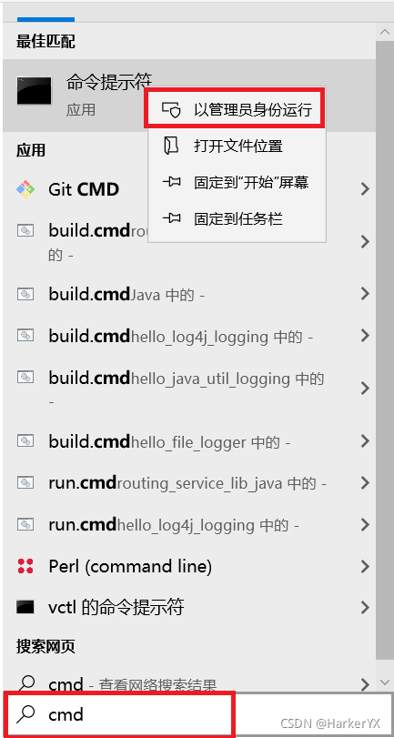
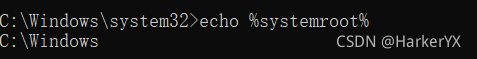

**WinSAT 是 Windows 系统评估工具（Windows System Assessment Tool）的缩写**，是从 Windows Vista 开始便内置于系统之中的命令行工具，可对 Windows PC 的各个组件进行基准测试

详细了解请参考  官方文档：[winsat disk](https://learn.microsoft.com/en-us/previous-versions/windows/it-pro/windows-server-2012-R2-and-2012/cc742157(v=ws.11))

### **使用方法：winsat \<名称\> \<参数\>**
- 以下方法可以使用 winsat --help 查看
- winsat dwm – 评估系统 Aero 桌面效果的能力
- winsat d3d – 评估系统运行 Direct 3D 应用程序的能力
- winsat mem – 评估系统内存带宽
- winsat disk – 评估磁盘驱动器的性能
- winsat cpu – 评估 CPU 的性能
- winsat media – 使用 Direct Show 框架来评估视频编码和解码的性能
- winsat mfmedia – 评估使用 Media Foundation 框架进行视频解码的性能
- winsat features – 列举相关的系统信息
- winsat formal – 基本包含上面所有的一体化测试


#### **1. 切记以管理员方式打开 cmd 命令窗口**

<div align=left>

</div>

<div align=left>

</div>

#### **2. 测试 winsat formal**

```tex
C:\Windows\system32>winsat formal
Windows 系统评估工具
> 正在运行正式评估
Machine already has a WinEI rating.  Rerunning all assessments ...
> 正在运行: 功能枚举 ''
> 运行时间 00:00:00.00
> 正在运行: WinSAT Direct3D 评估 '-aname DWM -time 10 -fbc 10 -disp off -normalw 1 -alphaw 2 -width 1280 -height 1024 -winwidth C(1144) -winheight C(915) -rendertotex 6 -rtdelta 3 -nolock'
> 评估桌面图形性能
> 运行时间 00:00:10.42
> 正在运行: WinSAT Direct3D 评估 '-aname Batch -time 5 -fbc 10 -disp off -animate 10 -width 1280 -height 1024 -totalobj 300 -batchcnt C(10) -objs C(26) -rendertotex 6 -rtdelta 3 -texpobj C(1)'
> 正在评估 DirectX Batch 性能
> 运行时间 00:00:00.11
> 正在运行: WinSAT Direct3D 评估 '-aname Alpha -time 5 -fbc 10 -disp off -animate 10 -width 1280 -height 1024 -totalobj 300 -batchcnt C(75) -objs C(26) -rendertotex 6 -rtdelta 3 -texpobj C(1)'
> 评估 DirectX Alpha blend 性能
> 运行时间 00:00:00.09
> 正在运行: WinSAT Direct3D 评估 '-aname Tex -time 5 -fbc 10 -disp off -animate 10 -width 1280 -height 1024 -totalobj 500 -batchcnt C(125) -objs C(20) -noalpha -texshader -totaltex 10 -texpobj C(4) -rendertotex 6 -rtdelta 3'
> 评估 DirectX Texture load 性能
> 运行时间 00:00:00.11
> 正在运行: WinSAT Direct3D 评估 '-aname ALU -time 5 -fbc 10 -disp off -animate 10 -width 1280 -height 1024 -totalobj 500 -batchcnt C(125) -objs C(20) -noalpha -alushader -totaltex 10 -texpobj C(1) -rendertotex 6 -rtdelta 3'
> 评估 DirectX ALU 性能
> 运行时间 00:00:00.14
> 正在运行: WinSAT Direct3D 评估 '-dx10  -aname Batch -time 5 -fbc 10 -disp off -animate 10 -width 1280 -height 1024 -totalobj 300 -batchcnt C(10) -objs C(26) -rendertotex 6 -rtdelta 3 -texpobj C(1)'
> 运行时间 00:00:00.00
> 正在运行: WinSAT Direct3D 评估 '-dx10  -aname Alpha -time 5 -fbc 10 -disp off -animate 10 -width 1280 -height 1024 -totalobj 300 -batchcnt C(75) -objs C(26) -rendertotex 6 -rtdelta 3 -texpobj C(1)'
> 运行时间 00:00:00.00
> 正在运行: WinSAT Direct3D 评估 '-dx10  -aname Tex -time 5 -fbc 10 -disp off -animate 10 -width 1280 -height 1024 -totalobj 500 -batchcnt C(125) -objs C(20) -noalpha -texshader -totaltex 10 -texpobj C(4) -rendertotex 6 -rtdelta 3'
> 运行时间 00:00:00.00
> 正在运行: WinSAT Direct3D 评估 '-dx10  -aname ALU -time 5 -fbc 10 -disp off -animate 10 -width 1280 -height 1024 -totalobj 500 -batchcnt C(125) -objs C(20) -noalpha -alushader -totaltex 10 -texpobj C(1) -rendertotex 6 -rtdelta 3'
> 运行时间 00:00:00.00
> 正在运行: WinSAT Direct3D 评估 '-dx10  -aname GeomF4 -time 7 -fbc 10 -disp off -animate 10 -width 1280 -height 1024 -totalobj 150;200;241 -batchcnt C(50);C(200);C(300) -objs C(12);C(26);C(45) -noalpha -geomf4shader -texpobj C(0) -rendertotex 6 -rtdelta 3 -tierframes 60 -tiertime 1'
> 运行时间 00:00:00.00
> 正在运行: WinSAT Direct3D 评估 '-dx10  -aname GeomV8 -time 7 -fbc 10 -disp off -animate 10 -width 1280 -height 1024 -totalobj 75;100;120 -batchcnt C(25);C(100);C(150) -objs C(8);C(17);C(29) -noalpha -geomv8shader -texpobj C(0) -rendertotex 6 -rtdelta 3 -tierframes 60 -tiertime 1'
> 运行时间 00:00:00.00
> 正在运行: WinSAT Direct3D 评估 '-dx10  -aname CBuffer -time 5 -fbc 10 -disp off -animate 10 -width 1280 -height 1024 -totalobj 75 -batchcnt C(25) -objs C(8) -rendertotex 6 -rtdelta 3 -texpobj C(1) -cbuffershader -cbufa 2 -cbuff 5 -cbufp 6'
> 运行时间 00:00:00.00
> MOOBE 运行时间 00:00:11.55
> 正在运行: CPU 评估 '-encryption -up'
> 运行时间 00:00:03.08
> 正在运行: CPU 评估 '-compression -up'
> 运行时间 00:00:10.11
> 正在运行: CPU 评估 '-encryption2 -up'
> 运行时间 00:00:03.11
> 正在运行: CPU 评估 '-compression2 -up'
> 运行时间 00:00:10.11
> 正在运行: CPU 评估 '-encryption'
> 运行时间 00:00:10.20
> 正在运行: CPU 评估 '-compression'
> 运行时间 00:00:10.22
> 正在运行: CPU 评估 '-encryption2'
> 运行时间 00:00:10.11
> 正在运行: CPU 评估 '-compression2'
> 运行时间 00:00:10.19
> 正在运行: 系统内存性能评估 ''
> 运行时间 00:00:05.20
> 正在运行: 存储评估 '-seq -read -n 0'
> 运行时间 00:00:01.76
> 正在运行: 存储评估 '-ran -read -n 0'
> 运行时间 00:00:00.13
> 运行时间 00:00:00.00
> CPU LZW 压缩                                   495.64 MB/s
> CPU AES256 加密                                7662.19 MB/s
> CPU Vista 压缩                                 1334.35 MB/s
> CPU SHA1 哈希                                  2574.70 MB/s
> 单处理器 CPU LZW 压缩                              100.08 MB/s
> 单处理器 CPU AES256 加密                           1182.78 MB/s
> 单处理器 CPU Vista 压缩                            245.98 MB/s
> 单处理器 CPU SHA1 哈希                             630.19 MB/s
> 内存性能                                         17768.52 MB/s
> Direct3D Batch 性能                            42.00 F/s
> Direct3D Alpha Blend 性能                      42.00 F/s
> Direct3D ALU 性能                              42.00 F/s
> Direct3D Texture Load 性能                     42.00 F/s
> Direct3D Batch 性能                            42.00 F/s
> Direct3D Alpha Blend 性能                      42.00 F/s
> Direct3D ALU 性能                              42.00 F/s
> Direct3D Texture Load 性能                     42.00 F/s
> Direct3D Geometry 性能                         42.00 F/s
> Direct3D Geometry 性能                         42.00 F/s
> Direct3D Constant Buffer 性能                  42.00 F/s
> 视频内存吞吐量                                      4372.71 MB/s
> Dshow 视频编码时间                                 0.00000 s
> Dshow 视频解码时间                                 0.00000 s
> 媒体基础解码时间                                     0.00000 s
> Disk  Sequential 64.0 Read                   1920.06 MB/s          9.0
> Disk  Random 16.0 Read                       602.68 MB/s          8.4
```

- 测试结果数据保存到 %systemroot%\performance\WinSAT\datastore 文件夹的 XML 文件当中
- 或者是 %WINDIR%\performance\WinSAT\datastore

<div align=left>

</div>
<div align=left>

</div>
<div align=left>

</div>
- 如果需要重新评估 可以执行 `winsat formal -restart`


#### **3. 评估磁盘性能**

-  winsat disk 使用系统默认配置帮你完整测试磁盘性能

```tex
C:\Windows\system32>winsat disk
Windows 系统评估工具
> 正在运行: 功能枚举 ''
> 运行时间 00:00:00.00
> 正在运行: 存储评估 '-ran -read -n 0'
> 运行时间 00:00:00.14
> 正在运行: 存储评估 '-seq -read -n 0'
> 运行时间 00:00:01.81
> 正在运行: 存储评估 '-seq -write -drive C:'
> 运行时间 00:00:01.28
> 正在运行: 存储评估 '-flush -drive C: -seq'
> 运行时间 00:00:00.38
> 正在运行: 存储评估 '-flush -drive C: -ran'
> 运行时间 00:00:00.41
> Dshow 视频编码时间                                 0.00000 s
> Dshow 视频解码时间                                 0.00000 s
> 媒体基础解码时间                                     0.00000 s
> Disk  Random 16.0 Read                       552.51 MB/s          8.3
> Disk  Sequential 64.0 Read                   1979.03 MB/s          9.0
> Disk  Sequential 64.0 Write                  1615.20 MB/s          8.9
> 顺序写操作的平均读取时间                                 0.062 ms          8.9
> 延迟: 95%                                      0.189 ms          8.9
> 延迟: 最大                                       5.695 ms          8.4
> 随机写操作的平均读取时间                                 0.070 ms          8.9
> 总运行时间 00:00:04.06
```

- **通过测试打印，可以看出 winsat disk 其实后面可以跟参数**
  - `-ran` 随机
  - `-seq` 顺序
  - `-read` 读
  - `-write` 写
  - `-flush` 在写策略冲洗模式下评估磁盘性能。不能与 -seq、-ran、- write或 - read相结合使用
  - `-drive` 指定盘符

```tex
C:\Windows\system32>winsat disk  -ran -read
Windows 系统评估工具
> 正在运行: 功能枚举 ''
> 运行时间 00:00:00.00
> 正在运行: 存储评估 '-ran -read -n 0'
> 运行时间 00:00:00.14
> Dshow 视频编码时间                                 0.00000 s
> Dshow 视频解码时间                                 0.00000 s
> 媒体基础解码时间                                     0.00000 s
> Disk  Random 16.0 Read                       547.67 MB/s          8.3
> 总运行时间 00:00:00.19
 
C:\Windows\system32>winsat disk  -ran -write
Windows 系统评估工具
> 正在运行: 功能枚举 ''
> 运行时间 00:00:00.00
> 正在运行: 存储评估 '-ran -write -drive C:'
> 运行时间 00:00:00.16
> Dshow 视频编码时间                                 0.00000 s
> Dshow 视频解码时间                                 0.00000 s
> 媒体基础解码时间                                     0.00000 s
> Disk  Random 16.0 Write                      566.44 MB/s
> 总运行时间 00:00:00.17
 
C:\Windows\system32>winsat disk  -ran -write -drive d
Windows 系统评估工具
> 正在运行: 功能枚举 ''
> 运行时间 00:00:00.00
> 正在运行: 存储评估 '-ran -write -drive d'
> 运行时间 00:00:00.16
> Dshow 视频编码时间                                 0.00000 s
> Dshow 视频解码时间                                 0.00000 s
> 媒体基础解码时间                                     0.00000 s
> Disk  Random 16.0 Write                      561.45 MB/s
> 总运行时间 00:00:00.17
```

#### **4. 评估内存性能** 

- winsat mem 使用系统默认配置帮你完整测试内存性能

```tex
C:\Windows\system32>winsat mem
Windows 系统评估工具
> 正在运行: 功能枚举 ''
> 运行时间 00:00:00.00
> 正在运行: 系统内存性能评估 ''
> 运行时间 00:00:05.13
> 内存性能                                         17875.31 MB/s
> Dshow 视频编码时间                                 0.00000 s
> Dshow 视频解码时间                                 0.00000 s
> 媒体基础解码时间                                     0.00000 s
> 总运行时间 00:00:05.77
```

- **winsat mem 参数：**
  - `-up` ：仅使用一个线程强制内存测试，默认值是每个物理 CPU 或内核运行一个线程
  - `-rn` ：指定评估的线程应以正常优先级运行。默认值是优先级 15 运行
  - `-mint n` ：最短的运行时间 秒为单位 ，默认值为 2.0，最低值为 1.0，最大值为 30.0
  - `-maxt n` ：最长的运行时间 秒为单位，默认值为 5.0，最低值为 1.0，最大值为 30.0
    * -mint value greater than the -maxt  error！！！
  - `-buffersize n` ：评估所应该使用的缓存大小，默认为16MB，最大值为 32MB，最低值为 4 KB

```tex
C:\Windows\system32>winsat mem -up -rn -mint 5.0 -maxt 10.0 -buffersize 32M
Windows 系统评估工具
> 正在运行: 功能枚举 ''
> 运行时间 00:00:00.00
> 正在运行: 系统内存性能评估 '-up -rn -mint 5.0 -maxt 10.0 -buffersize 32M'
> 运行时间 00:00:10.09
> 内存性能                                         22207.21 MB/s
> Dshow 视频编码时间                                 0.00000 s
> Dshow 视频解码时间                                 0.00000 s
> 媒体基础解码时间                                     0.00000 s
```

#### **5. 评估处理器性能**

- winsat cpu  使用系统默认配置帮你完整测试cpu性能
- 注意，默认要加上  - encryption 或者 - compression 参数才有效
- **winsat cpu 参数：**
  - `-encryption` ：使用 256 位 AES 加密算法评估 CPU 性能
  - `-encryption2` ：运行加密和解密评估计算 SHA1 哈希
  - `-compression` ：使用 Lempel-Zev 算法运行压缩和解压缩评估
  - `-compression2` ：使用微软内部压缩算法运行压缩和解压缩评估
  - `-buffersize <n>` ： 定义评估的缓冲大小。最低值为 4 K。最大值为 2 MB。默认值为 16 KB
  - `-xml <文件名称>` ：将评估输出保存为指定的 XML 文件。如果存在指定的文件，它将被覆盖

```tex
C:\Windows\system32>winsat cpu -encryption -xml test_cpu.xml
Windows 系统评估工具
> 正在运行: 功能枚举 ''
> 运行时间 00:00:00.00
> 正在运行: CPU 评估 '-encryption'
> 运行时间 00:00:10.17
> CPU AES256 加密                                7643.46 MB/s
> Dshow 视频编码时间                                 0.00000 s
> Dshow 视频解码时间                                 0.00000 s
> 媒体基础解码时间                                     0.00000 s
> 总运行时间 00:00:10.77
```

- 需要注意的是指定 -xml 默认保存在 %WINDIR%\System32 目录下，如需保存到其他位置可指定 盘符:\ + 目录路径

```tex
C:\Windows\system32>winsat cpu -encryption -xml d:\test_cpu.xml
Windows 系统评估工具
> 正在运行: 功能枚举 ''
> 运行时间 00:00:00.00
> 正在运行: CPU 评估 '-encryption'
> 运行时间 00:00:10.13
> CPU AES256 加密                                7700.47 MB/s
> Dshow 视频编码时间                                 0.00000 s
> Dshow 视频解码时间                                 0.00000 s
> 媒体基础解码时间                                     0.00000 s
> 总运行时间 00:00:10.72
```

- 更多内容请看官方文档