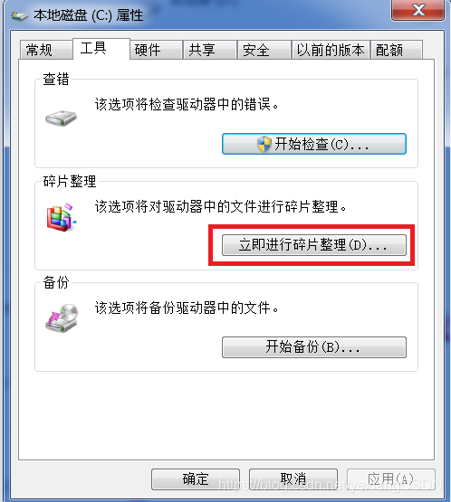
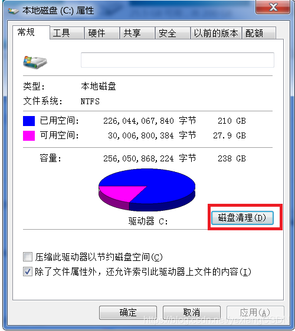

1、C:\Windows\Temp  存储系统临时文件

2、C:\Windows\SoftwareDistribution\Download 存储系统升级日志和补丁文件

3、C:\Windows\System32\LogFiles 日常应用日志文件

4、C:\Windows\Prefetch 系统预读信息

- 以上文件都可以删除，但使用久后 磁盘会出现很多碎片，可以借助系统工具

- 当然如果安装了360这类软件，也可以使用这类软件进行释放一些空间

